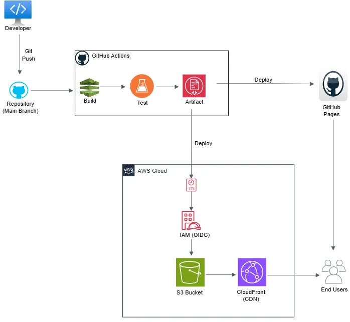

## Hi there 👋

<!--
**ecoderP/ecoderP** is a ✨ _special_ ✨ repository because its `README.md` (this file) appears on your GitHub profile.
-->

# Hi, I'm Paul Onyebuchi 👋

Cloud Engineer focused on AWS, CI/CD, and cloud-native web deployment.

## Background:

- Chemical Engineering
- Municipal Water Treatment & Distribution
- 5+ years Web Development
- AWS Certified Cloud Practitioner

My background in municipal infrastructure systems informs how I approach cloud engineering: designing for reliability, operational consistency, and scalable system delivery.

## Currently building:

- CI/CD pipelines with GitHub Actions
- AWS deployments (S3, CloudFront, IAM)
- Serverless AI-driven web application (Amplify, Lambda, API Gateway, Bedrock)
- Infrastructure as Code with Terraform

## Certifications

- AWS Certified Cloud Practitioner
- Preparing for AWS Certified Solutions Architect Associate

## Core Stack

### Cloud

- AWS S3
- CloudFront
- IAM
- CloudTrail
- EC2
- VPN, Subnets, ACLs
- Bedrock

### DevOps / Automation

- GitHub Actions
- OIDC
- CI/CD Pipelines

### Infrastructure as Code

- Terraform

### Frontend

- React
- Vite
- JavaScript
- CSS, Tailwind CSS

### Testing

- Vitest

## Featured Projects

### 1. Dual Platform CI/CD Deployment Pipeline - Cloud-Native Static Web Delivery Platform with Automated CI/CD

A production-grade deployment pipeline for a React application deployed to AWS and GitHub Pages.

#### Highlights

- Automated testing and deployment across two hosting targets.
- Reduced deployment time from manual process to under 2 minutes.
- OIDC secure AWS authentication
- S3 deployment
- CloudFront cache invalidation ensures users always see the most recent updates.
- Dual deployment strategy

## Tech

React + Vite | AWS S3 | CloudFront | GitHub Actions | IAM Role | CloudTrail | Vitest | Tailwind CSS

## Links

- [Live Demo](https://paulbuchi.xyz)
- 
- [Repo](https://github.com/ecoderP/portfolio-3.0)

## Connect

LinkedIn: [Paul Onyebuchi](https://www.linkedin.com/in/paulonyebuchi/)
Portfolio: [Websie](https://paulbuchi.xyz)
